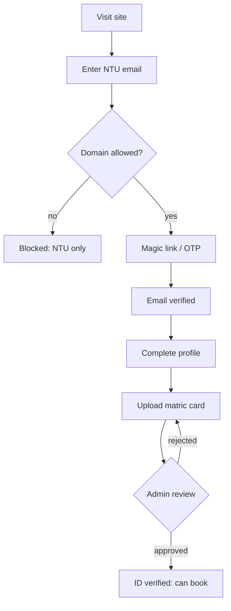
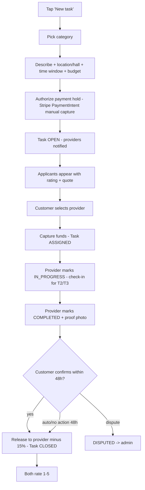
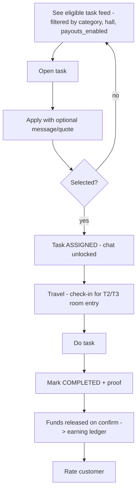

# 04 — User Flows

Notation: each flow is a numbered happy path + key branches. State names match `task_status`.

## A. Onboarding & verification (both roles)
1. Land on marketing page → "Join with NTU email".
2. Enter `@e.ntu.edu.sg` email → receive magic link / OTP → email verified (`EMAIL` ✓).
3. Complete profile: name, photo, hall, school, year.
4. Upload matric card → status `PENDING` → admin reviews → `STUDENT_ID` ✓ (or rejected with reason).
5. (Optional) Declare hall + proof → `HALL` ✓.
6. Browsing is unlocked after EMAIL ✓. **Booking** requires EMAIL ✓ + STUDENT_ID ✓.

## B. Become a provider (earn)
1. From profile, toggle "Start earning".
2. Accept Provider Agreement + **work-eligibility self-declaration** (work-pass hours acknowledgement).
3. Select categories offered.
4. Redirect to **Stripe Connect Express** onboarding (Stripe collects KYC/bank).
5. On return, webhook sets `payouts_enabled` when Stripe confirms `charges_enabled && payouts_enabled`.
6. Toggle "Available" → start seeing eligible tasks.

## C. Customer creates & completes a task (core loop)

Branches:
- **Cancel before ASSIGNED:** customer cancels → PaymentIntent canceled, no charge.
- **Cancel after ASSIGNED, before IN_PROGRESS:** policy-based partial/refund (MVP: full refund minus payment-processing if provider hadn't started).
- **No applicants in 30 min:** prompt customer to raise budget or broaden window; push re-broadcast.

## D. Provider accepts & fulfils

## E. Dispute resolution (admin)
1. Either party opens dispute on a COMPLETED/IN_PROGRESS task within 48h.
2. Task → `DISPUTED`; funds held (not released).
3. Admin reviews chat, proof photos, check-in/out, ledger.
4. Resolution: full refund / release / split → ledger + Stripe refund/transfer accordingly.

## F. Safety flow (in-person tasks)
- On ASSIGNED, both parties get safety tips + each other's verified first name/photo + a "Share live task" link.
- T2/T3: provider must **check-in** (geo + timestamp) to mark IN_PROGRESS and **check-out** to mark COMPLETED.
- **SOS** button → logs `safety_event`, notifies admin, surfaces campus security contact + the shared friend link.

## G. Admin daily flow
Verification queue → approve/reject IDs → triage disputes → monitor payouts/failed transfers → review safety events → spot-check low-rated users.
